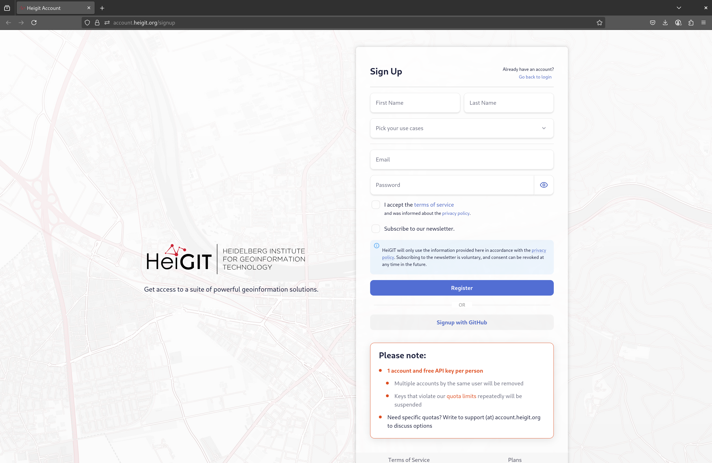
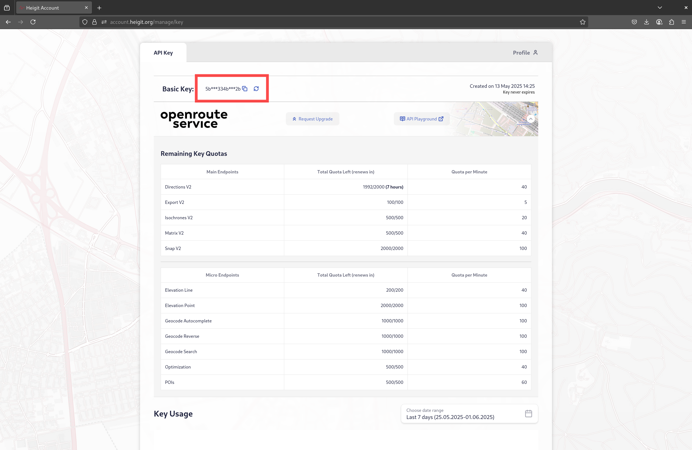
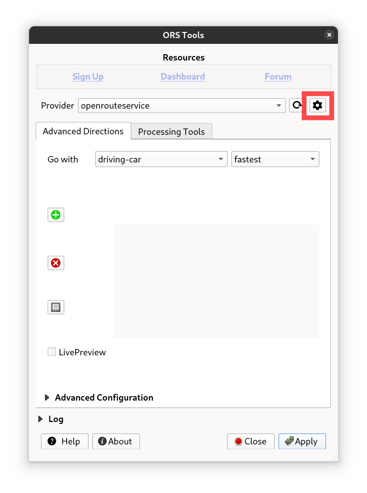

# Installation

## Default Installation
The ORS plugin is available over the official [QGIS plugin repository](https://plugins.qgis.org/plugins/ORStools/) and is best installed from the QGIS built-in Plugin Manager.

## Development Installation
However, if you want or need to install the latest development version:
1. Download the ZIP archive from the [`main`](https://github.com/GIScience/orstools-qgis-plugin/tree/main) branch
2. Unzip and copy the folder `ORStools` into your system's QGIS plugin directory:
  - **Linux**: `~/.local/share/QGIS/QGIS3/profiles/default/python/plugins`
  - **Windows**: `C:\Users\USER\AppData\Roaming\QGIS\QGIS3\profiles\default\python\plugins`
  - **Mac OS**: `Library/Application Support/QGIS/QGIS3/profiles/default/python/plugins`
3. Restart QGIS and if necessary, activate the ORS Tools plugin over the Plugin Manager.

# Provider Settings

In the configuration window (`Web` > `ORS Tools` > `Configuration`) you have set up the API key, which will be saved
locally in the QGIS settings and will automatically be used across all tools. Here you can also set the base URL in
case you're using a self-hosted ORS version and the requests per minute you're allocated (usually set to 60).

## Sign up for an API key
First, you'll have to [sign up](https://account.heigit.org/signup) and copy your API key from
your [HeiGIT account dashboard](https://account.heigit.org).

## Set up the API key in QGIS
1. Open the configuration window by going to `Web` > `ORS Tools` > `Configuration`. Or by clicking the gear icon in the plugin.
2. Open the provider box by clicking on the caret icon next to the provider name.
3. Enter your API key in the `API Key` field.

